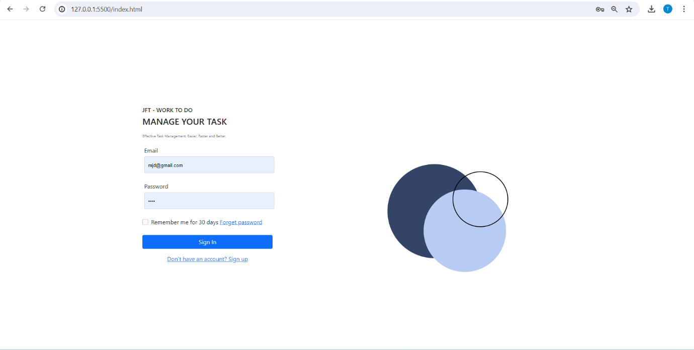
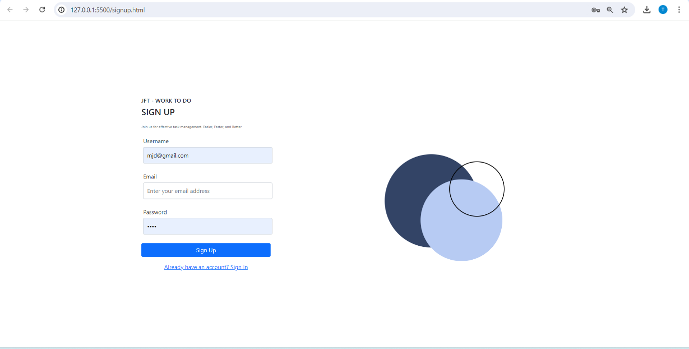
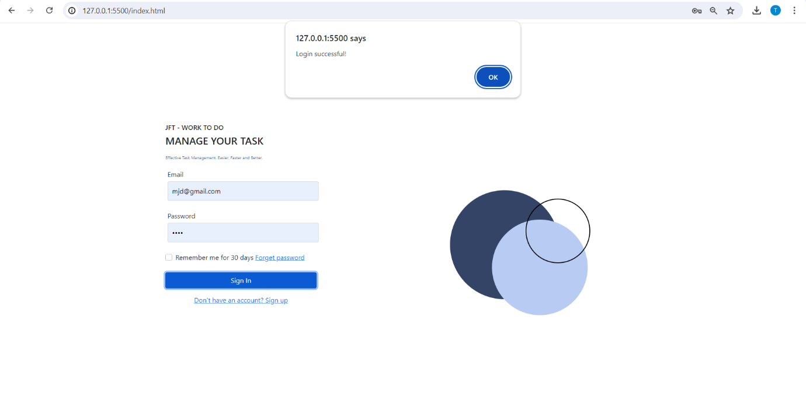
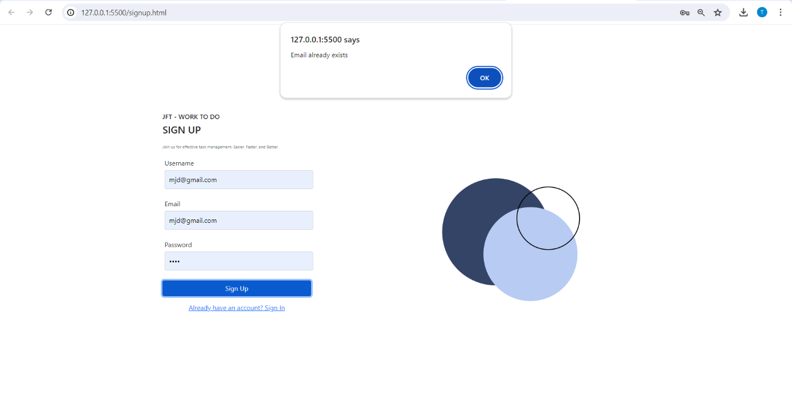
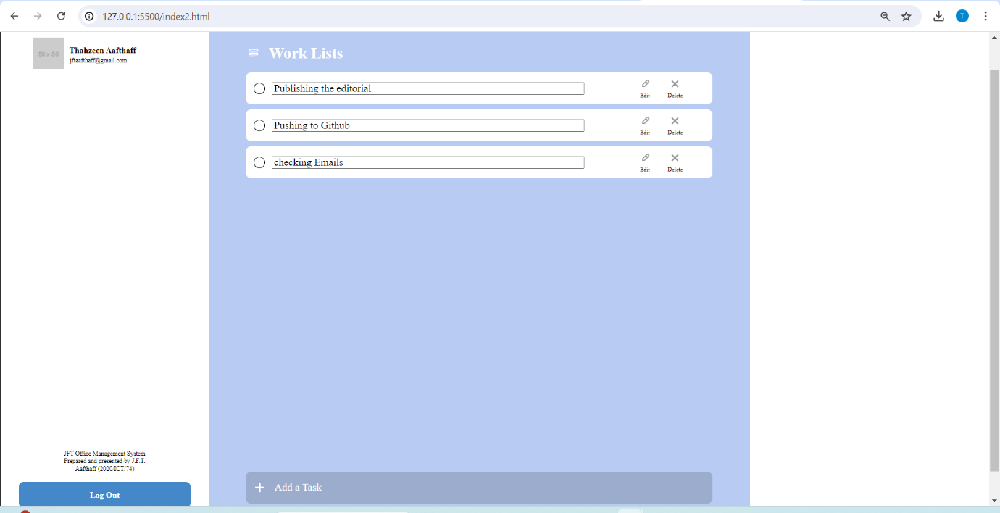

# JFT Office Task Management System

The Office Task Management System is a web application designed to help users organize and manage their tasks effectively. The system will provide features for creating, updating, and deleting tasks, as well as viewing the list of tasks. The backend will be built using Node.js and Express.js, while the frontend will be developed using HTML, CSS, and JavaScript.



## Acknowledgements

- **Node.js**: The JavaScript runtime built on Chrome's V8 JavaScript engine, which allows you to build fast and scalable server-side applications.
- **Express.js**: A fast, unopinionated, minimalist web framework for Node.js.
- **MongoDB**: A source-available cross-platform document-oriented database program.
- **Mongoose**: Elegant MongoDB object modeling for Node.js.
- **bcrypt**: A library to help you hash passwords.
- **bcryptjs**: Optimized bcrypt in JavaScript with zero dependencies.
- **jsonwebtoken**: Implementation of JSON Web Tokens for Node.js.
- **Morgan**: HTTP request logger middleware for Node.js.
- **cookie-parser**: Parse cookie header and populate req.cookies.
- **cors**: Middleware for enabling CORS (Cross-Origin Resource Sharing) in Express.js.
- **http-errors**: Create HTTP errors for Express, Koa, Connect, etc., with ease.
- **ejs**: Embedded JavaScript templates.

## API Reference

### Authentication

#### Sign Up
- **Endpoint**: `/auth/signup`
- **Method**: `POST`
- **Description**: Registers a new user.
- **Request Body**:
  ```json
  {
    "username": "string",
    "email": "string",
    "password": "string"
  }
  ```
- **Response**:
  - `201 Created` on success
  - `400 Bad Request` if the email already exists
  - `500 Internal Server Error` on failure

#### Login
- **Endpoint**: `/auth/login`
- **Method**: `POST`
- **Description**: Authenticates a user and returns a JWT token.
- **Request Body**:
  ```json
  {
    "email": "string",
    "password": "string"
  }
  ```
- **Response**:
  - `200 OK` with a JWT token on success
  - `401 Unauthorized` if credentials are invalid
  - `500 Internal Server Error` on failure

#### Profile
- **Endpoint**: `/auth/profile`
- **Method**: `POST`
- **Description**: Accesses the profile of the authenticated user.
- **Headers**:
  ```json
  {
    "Authorization": "Bearer <JWT_TOKEN>"
  }
  ```
- **Response**:
  - `200 OK` with user profile data on success
  - `403 Forbidden` if the token is invalid or missing
  - `500 Internal Server Error` on failure

### Users

#### Create User
- **Endpoint**: `/users/create`
- **Method**: `POST`
- **Description**: Creates a new user.
- **Request Body**:
  ```json
  {
    "username": "string",
    "email": "string",
    "password": "string"
  }
  ```
- **Response**:
  - `201 Created` on success
  - `400 Bad Request` if the username or email already exists
  - `500 Internal Server Error` on failure

#### Update User
- **Endpoint**: `/users/update/:userId`
- **Method**: `PATCH`
- **Description**: Updates the user information.
- **Request Body**:
  ```json
  {
    "username": "string",
    "email": "string",
    "password": "string"
  }
  ```
- **Response**:
  - `200 OK` on success
  - `404 Not Found` if the user is not found
  - `500 Internal Server Error` on failure

#### Delete User
- **Endpoint**: `/users/delete/:userId`
- **Method**: `DELETE`
- **Description**: Deletes the user.
- **Response**:
  - `200 OK` on success
  - `404 Not Found` if the user is not found
  - `500 Internal Server Error` on failure

#### Get User
- **Endpoint**: `/users/get/:userId`
- **Method**: `GET`
- **Description**: Retrieves the user information.
- **Response**:
  - `200 OK` with user data on success
  - `404 Not Found` if the user is not found
  - `500 Internal Server Error` on failure

### Tasks

#### Create Task
- **Endpoint**: `/auth/task-create`
- **Method**: `POST`
- **Description**: Creates a new task.
- **Request Body**:
  ```json
  {
    "description": "string"
  }
  ```
- **Response**:
  - `201 Created` on success
  - `500 Internal Server Error` on failure

#### Update Task
- **Endpoint**: `/auth/task-update/:taskId`
- **Method**: `PATCH`
- **Description**: Updates a task.
- **Request Body**:
  ```json
  {
    "description": "string"
  }
  ```
- **Response**:
  - `200 OK` on success
  - `404 Not Found` if the task is not found
  - `500 Internal Server Error` on failure

#### Get All Tasks
- **Endpoint**: `/auth/task-get-all`
- **Method**: `GET`
- **Description**: Retrieves all tasks.
- **Response**:
  - `200 OK` with tasks data on success
  - `500 Internal Server Error` on failure

#### Delete Task
- **Endpoint**: `/auth/task-delete/:taskId`
- **Method**: `DELETE`
- **Description**: Deletes a task.
- **Response**:
  - `200 OK` on success
  - `404 Not Found` if the task is not found
  - `500 Internal Server Error` on failure

## Appendix

### Node.js and NPM:
Ensure you have Node.js and npm installed on your machine.

### MongoDB:
Ensure you have MongoDB installed and running on your local machine.

```
project-root/
│
├── bin/
│   └── www
│
├── routes/
│   ├── index.js
│   ├── login.js
│   └── users.js
│
├── views/
│   ├── error.ejs
│   └── index.ejs
│
├── app.js
├── package.json
├── package-lock.json
└── README.md
```

## Useful Resources

- [Express Documentation](https://expressjs.com/)
- [MongoDB Documentation](https://docs.mongodb.com/)
- [Mongoose Documentation](https://mongoosejs.com/docs/guide.html)
- [JWT (JSON Web Tokens)](https://jwt.io/introduction/)
- [BCrypt for Password Hashing](https://www.npmjs.com/package/bcrypt)

## Common Issues and Troubleshooting

### Port Conflicts:
If you encounter an error about a port being in use, change the port number in the `bin/www` file or ensure the port is not used by another application.

### MongoDB Connection Issues:
Ensure MongoDB is running and accessible at the specified URL (`mongodb://127.0.0.1:27017/udb`).

### Environment Variables:
Ensure sensitive information like JWT secret keys are stored in environment variables and not hardcoded in the source code.

## Sample Data

### Sign Up:
```json
{
  "username": "testuser",
  "email": "testuser@example.com",
  "password": "password123"
}
```

### Login:
```json
{
  "email": "testuser@example.com",
  "password": "password123"
}
```

### Create Task:
```json
{
  "description": "Sample task description"
}
```

## Authors

- [@ThahzeenAfthaff](https://www.github.com/ThahzeenAfthaff)

## Color Reference

### Colors

This project uses the following color scheme:

#### Primary Colors

- **Dark Blue**: `#334466`
- **Light Blue**: `#4488C9`
- **Light Grey**: `#B7CBF3`

#### Text Colors

- **Black**: `#000000`
- **White**: `#FFFFFF`

#### Additional Colors

- **Shadow Color**: `#fff`
- **Border Color**: `#CCC`
- **Muted Text Color**: `#6c757d`

## Deployment

To deploy this project run:

```bash
npm i
npx nodemon
```

to the backend terminal.






